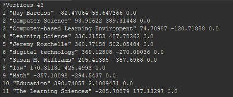
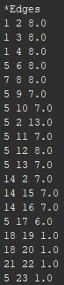
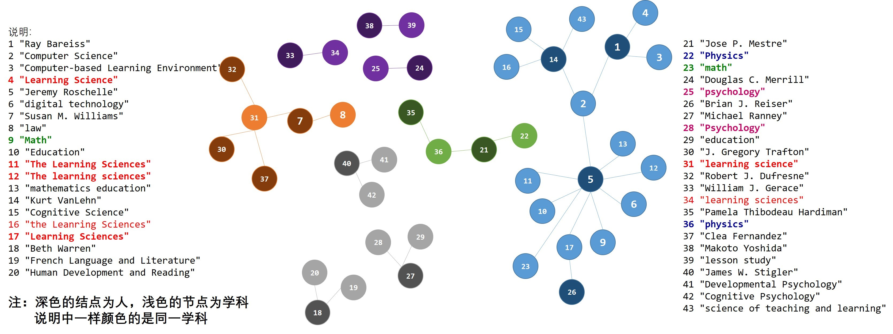
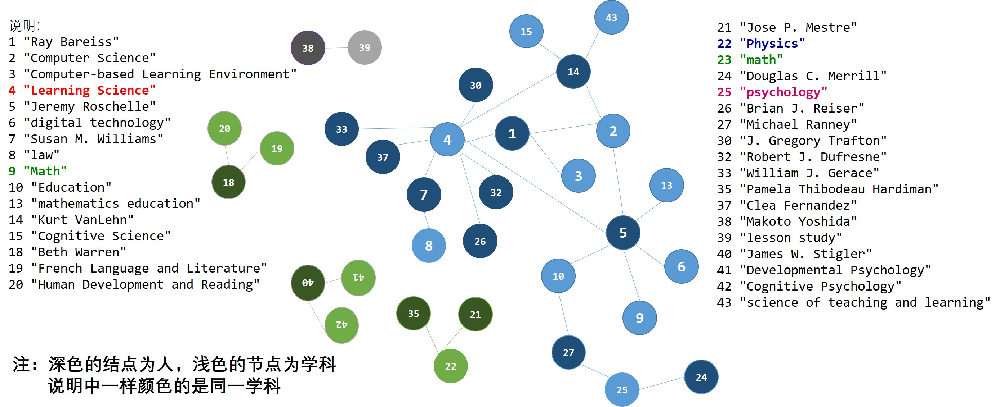

# 请大家在这个页面，记录课堂上分享的作业

### 学习科学的学科基础？ （图文并茂）
> 1. 如何收集数据的？收集过程中遇到了什么问题？
> 2. 数据以何种格式存放？为什么选择这样存放？
> 3. 如何生成二分网络的？比如：使用了什么工具 （使用的具体步骤），为什么使用此类工具？
> 4. 如何进行二分网络转换的（具体步骤）？
> 5. 有什么新的发现来回答“学习科学的学科基础”这个问题。

### 唐文静的分享
#### 1.查找的问题
 一开始是直接以名字为词条在浏览器上进行搜索，后来慢慢搜索发现有个领英的社交网站上面基本能搜出要找的人，为此还注册了一个账号，如果在这里搜不到，才回去在维基百科等其他平台搜。搜索过程中遇到的问题主要是两个：
 
一是搜索出来的人太多，需要不断筛选

二是搜不到这个人。
#### 2.在数据处理过程中主要也是两个问题：
>一是在搜索过程中还有一些不确定的数据，比如math education和science education都是education类的，该归成一类还是拆分出来，还有带“and”的是拆成两类还是合成一类，比如Media Arts and Sciences，还有人本科是心理学，硕士是认知心理学，改归成一类吗？还有一些是自我介绍，然后介绍时是说自己从事哪方面研究，并不说明属于哪个系别，比如Human Cognition and Learning，所以自己就难以判断出来，于是就直接复制进去了

>二是搜索之后，看到平台上的有些学科我是没搜到的，也不敢把数据删除了，同时我在第二周上课时才知道，有些数据格式不对的需要改，我当时在清理数据时没有意识到这一点

#### 3.数据存储整理过程
数据是在excel里面存储的，因为自己比较熟悉excel吧，但是一开始不太理解老师的意思，自己在excel上面做的表格乱七八糟的

![][1]

[1]:
../images/twj/shu0.png

>后来问了同学就重新整理了数据

![][2]

[2]:
../images/twj/shu1.png

>同时手动将excel另存了notelist文件

![][3]

[3]:
../images/twj/shu2.png

#### 4.生成二部图的过程
>一开始是手写，后来用了Gephi，先是吧excel里面的数据按照平台上edgelist.cvs和notelist.cvs文件的格式调了自己的数据，另存为.cvs文件，然后按照老师的步骤导进软件里面生成的

> 参照老师给的文件，但是生成过程中发现都是这样的黑点，而且每个点没有大小之分，也不显示权值之类的，如图所示

![][4]

[4]:
../images/twj/er0.png

![][5]

[5]:
../images/twj/er1.png

#### 5.学习科学的学科基础
我觉得应该在生成的二分网络图中，我一开始觉得观看哪个学科的重复的值比较多，就可以说明这个学科是学习科学的基础，但是每一年又是不断变化的，什么才是学科基础，是只要涉及的学科就是学科基础还是权值比较大的就是学科基础？那“权值大”怎么去界定呢？

### 陈香妤的分享（图片上传问题）
> 1.数据查询问题：
> 数据查询方面，主要是有一位学者的相关信息并没有查询到，即Merav Ilya。由于这位学者出现在一篇多作者文章的末尾，因此，我认为可能是当时某位学者的学生，此部分数据就无法查询到。因而，我继续使用了原来的数据。
> 2.数据准确性问题：
> 首先是学者重名问题：一开始查询的时候就对此问题产生了疑惑，不清楚自己查到的是否为正确的人。针对此问题，有同学提出可以使用悬停的方式查看作者的信息，然而我发现部分作者无法以此方式。因此，我自己采取的方法是查看此作者在期刊网上所有文章题目，大致确定其研究方向，以此对学者进行区分。
> 其次是和学者职业相关数据：由于许多学者都从事不止一个职业，因此其方向也具有多样性。针对此问题，我才用选取学者最频繁方向作为其此部分数据。
> 最后，我对比以前的数据，发现我负责的2003年以前基本每一位学者的数据都包含learning science。然而，在我查询后，缺鲜少有包含此学科的学者，这让我感到有些疑惑。
> 3.数据整理问题：
> 首先是不同学校对专业的命名问题：由于不同学校可能对同一专业采用不同命名方式，因此最后不太确定是否要将相似命名的专业归为同一专业。比如education science和science education是否为同一专业，这可能需要对相关大学学科及其学科介绍进行浏览才可确定
> 第二是对部分专业的理解问题：比如math和math education，以我们中国人的理解方式应该是不同专业，然而我疑惑对于国外学校是否也是如此。对于此问题，我认为还是应该浏览几所或者更多国外大学的专业设置,以探索其解决方案。
> 第三是对专业的归类问题：这部分问题包括两个。首先，对于各类科学专业，如computer science、cognitive science、learning science、education science是否应该归为同一类？以及这个专业归类的标准是什么？其次是，对于一些综合性的专业，例如learning, design and technology是否应该拆分为learning、design、technology再进行归纳，还是作为一个综合专业进行归纳？这部分问题是我比较困惑的，因而也影响了后续的二分网络图制作。
> 最后是数据的书写问题：因为在查询的时候，就发现专业的大小写似乎不一致。我最开始的做法是保持了原网站的书写格式，因为担心大小写会影响含义。在上传数据过程中，我发现以往数据几乎均以小写形式，由此我也改成了小写形式。但我还是比较困惑，比如教育，老师的格式是Education，而上一届数据是education，不知是否会有影响。
> 4.数据存储：
> 我还是采用的是，利用excel存储查到的数据，再手动导入平台。这种方法应当是比较费时费力的，之后会尝试讲Github导入本地，并使用Openrefine处理数据的方式。
> 5.二分网络图制作问题：
> 最开始使用了人工绘图的方式（excel），整个图都十分凌乱，无法进行任何分析。excel图如下。
> images/二部图-Excel（全）.png
> 之后由于正在学习Python，因此尝试用Python进行二分网络图制作。这个图让我比较困惑的是无法区分学科和作者，可能是我自己代码还是有些问题。Python图如下。
> images/二部图-Python.jpg
>之后应该首先会查看平台上分享的Python二分网络图源代码，修改我自己的代码，并尝试用Geph制作。
> 6.一些思考与疑问：
> 第一，对比往年，我们需要查询学者的职业。此处把现在的职业作为学科基础，让我有些疑惑。
> 第二，如果只是看学科权重和重复值，如何说明学习科学学科基础呢？取前三，还是多少？这种权重取前几排名不知如何界定。

### 王欣竹的分享
#### 1. 如何收集数据以及收集过程中遇到了什么问题
>一开始是直接在必应搜索作者姓名，后来发现了领英、ResearchGate、维基和facebook这几个比较好用的网站，各个大学的官网一般也有详细信息。
>遇到的问题：部分网页无法打开，可能需要翻墙；有个别学者还是学生，没有详细教育信息；不同网站的信息有细微出入，比如专业名称可能相差一两个单词；不确定哪些信息需要、哪些不需要，比如工作经历有很多，学术非学术的都有，是否应该全部收集。
#### 2. 数据以何种格式存放？为什么选择这样存放？
>我使用本地版的gituhub，使用csv存放，用记事本编辑。经过网络搜索，csv比xls文件好处在于更加轻量级，是平面化的数据，用来储存纯文本，不能储存公式等，但是也可以用excel编辑，便于后续用python批量处理。
#### 3. 如何生成二分网络的？比如：使用了什么工具 （使用的具体步骤），为什么使用此类工具？
>一开始想尝试使用python生成，但可能因为第三方库安装的问题，总是有一个Bug解决不了。最后选择使用Gephi和Sci2生成，就是按照老师发的帮助网页一步步生成的。
#### 4. 如何进行二分网络转换的（具体步骤）？
>就是参考老师发的帮助网页https://electricarchaeology.ca/2012/02/08/converting-2-mode-networks-to-1-mode-networks/， 但是发现需要把edgelist.csv的最后一列删掉，不然结果中会有undirected的点。而且最后是直接生成了单定点网络图。

#### 5. 有什么新的发现来回答“学习科学的学科基础”这个问题。
>在最终生成的单定点网络图中，连线比较密集的点，代表的学科应该就可以看作学习科学的学科基础。但是对于一些更详细的指标，比如平衡性、丰富度等等，还需要进一步使用其他技术探究。

### 王钰茹的分享
#### 1.	如何收集数据的？收集过程中遇到了什么问题？
> 一开始是直接在百度上搜索作者名，然后发现了领英、维基等网站。也曾想在cnki上看能不能搜到这个作者发的文章，但是很遗憾，可能是因为我查找的年份是1992年较早的时候，因此在cnki上很难搜到作者的文章。于是只有在领英、维基等网站上找。遇到的问题：不确定是否有重名的人；有些专业名称可能翻译不同，不确定是否应该归为一类。

#### 2.	数据以何种格式存放？为什么选择这样存放？
> 首先是将1992年的作者-学科数据（作者作为source，学科作为target，还有一列type均为undirected）存放在excel表格里，然后另存为.csv文件。

#### 3.	如何生成二分网络的？比如：使用了什么工具 （使用的具体步骤），为什么使用此类工具？
> 由于我的电脑打不开Gephi和sci，于是我在室友的电脑上将包含作者、学科的.csv文件导入Gephi里，导出二分网络文件。然后我直接利用导出的二分网络文件中的数据进行手工画图。

#### 4.	如何进行二分网络转换的（具体步骤）？
> 二分网络中的数据中将每一个学科和作者编号，还包括边（点A-点B-权重）的信息：
> 
> 

>最后通过PPT画出二分网络图如下：
> 

>在手工画二分网络图的过程中，首先发现很多点并不相连，而形成几个聚类（我猜想这是由于1992年的时候学习科学才刚起步，还未形成一个大型网络，也又可能是属于同一个学科的名字由于大小写等问题被分成了两个类别导致网络断点），于是我将属于一个聚类的点标成一个颜色，在每一个聚类中，将作者所在的点用深一点的颜色表示。
>然后又发现数据中很多学科是一样的，但是由于大小写等问题变成了两个类别。手动对这些数据进行清理之后，重新画出二分网络图：
> 

>可以看出，进行清理后的网络相比之前联结更加紧密了，可见数据清理的必要性。

#### 5.	有什么新的发现来回答“学习科学的学科基础”这个问题。
>可以将画出的二分网络图中网络最聚集的地方出现的学科看作学习科学的核心学科，如计算机科学、教育学、数学、认知科学等，将与之较远的学科看作学习科学的边缘学科，如物理、语言学、人类学等。核心学科是学习科学学科基础中的重要组成部分，但边缘学科可能同样也在其中发挥着作用甚至是关键作用，当然这需要具体的研究。
>存在的疑惑：（1）在上面的图中，心理学（41：发展心理学、42：认知心理学）按理说应该属于核心学科，但是在图中却是边缘学科，这是由于数据的原因？还是画图的原因？还是因为1992年的原因呢？（2）类似发展心理学和认知心理学这样的名字不同但又有共同之处的学科是否应该合并为一类呢？

