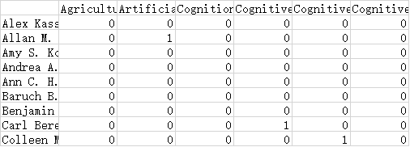
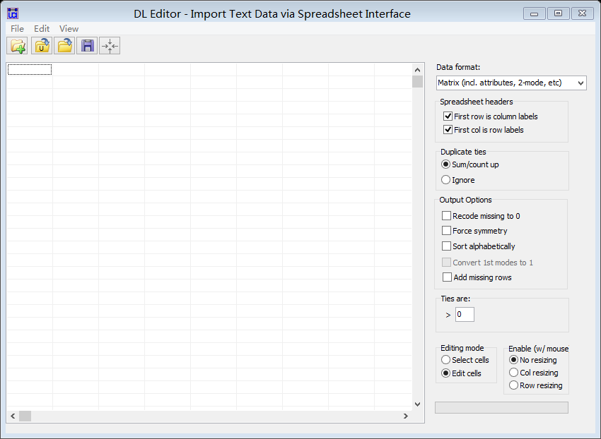
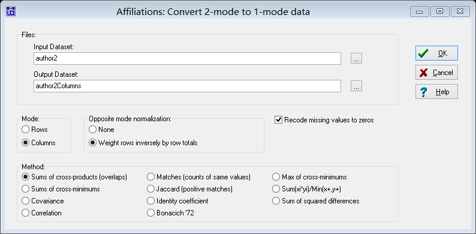
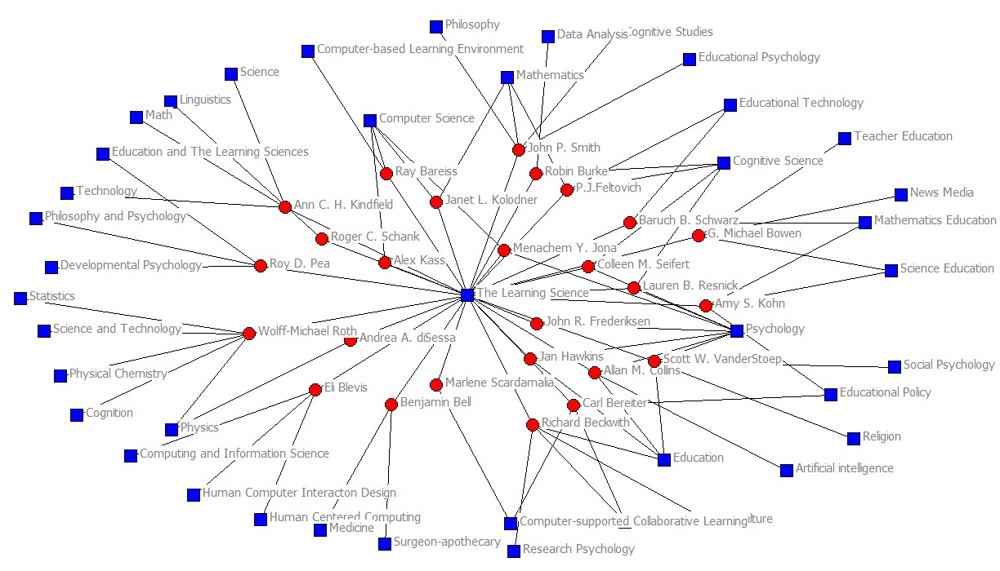
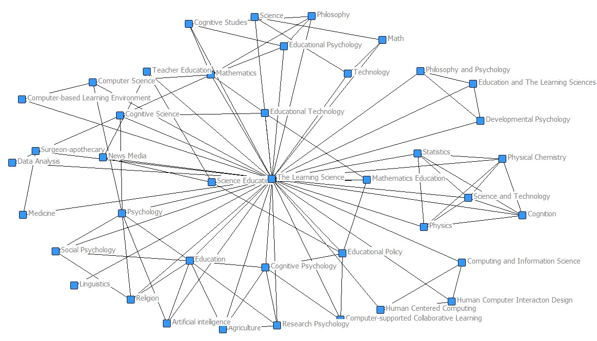
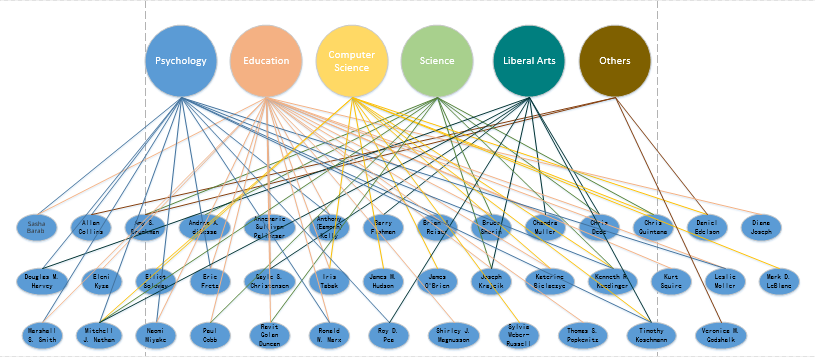
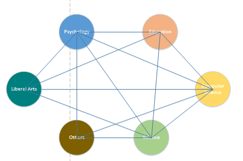
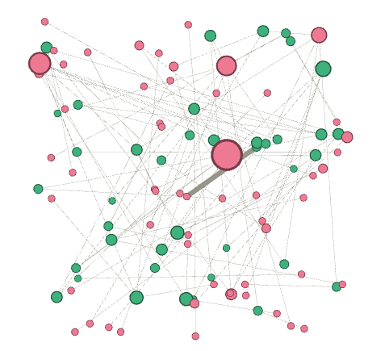
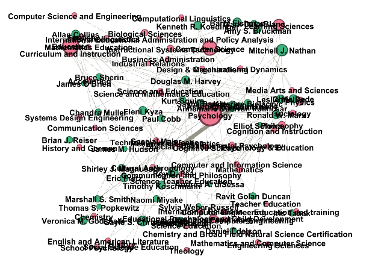
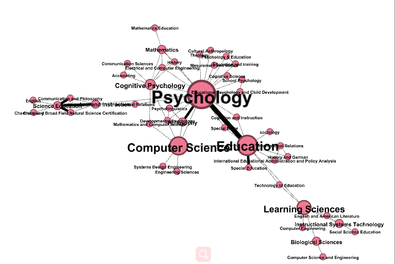

# 请大家在这个页面，记录课堂上分享的作业

### 学习科学的学科基础？ （图文并茂）
> 1. 如何收集数据的？收集过程中遇到了什么问题？
> 2. 数据以何种格式存放？为什么选择这样存放？
> 3. 如何生成二分网络的？比如：使用了什么工具 （使用的具体步骤），为什么使用此类工具？
> 4. 如何进行二分网络转换的（具体步骤）？
> 5. 有什么新的发现来回答“学习科学的学科基础”这个问题。

### 黄治霞的分享
1. 如何收集数据的？收集过程中遇到了什么问题？

【需要收集的数据】①作者，②作者毕业院系。

【收集方式】①期刊网址检索。②ResearchGate检索作者及大学，再进入相应的大学网站查找人事。③谷歌加上作者大学，论文标题等进行搜索。④领英搜索。

【收集问题】

①学者信息准确度问题。由于搜索来源不同，搜到的学者有的信息是缺失的，我对于这一类缺失值数据的处理是暂做标记，不录入数据库，或者采用之前的数据，但如果是大数据的话，不同的处理者的处理方法是否需要统一一下呢？

②数据记录问题。如果收集的数据较多的话，可能可以进行更多的分析，得到更多的更有价值的研究结论，目前收集的是作者的毕业院系和工作类别，可否再记录年份、学校等数据，这部分数据是各小组根据需要自行处理，还是全班同学分担数据处理工作？

【处理问题】

①数据清洗。我这次做的数据清洗工作比较简单，只是考虑了大小写和重复项，利用Excel工具将所有的大写换成小写，再删除重复项得到各个专业。这是由于个人数据流量较少，但是对于大数据还需要使用更高效的方式。

②专业类别。在处理专业的时候，我是简单的将专业分成了心理学、教育学、自然科学、计算机科学等，这几个分类是根据我所收集的年份数据得到的，分类根据数据直观体现所得，没有科学依据，有考虑过根据学科分类的方法分类，但是这种分类方法有一个问题就是与学习科学有关的学科相关程度体现问题。如假设学习科学与数学有很强的相关性，由于数学属于自然科学，可以得到其与自然科学有很强相关，但是学习科学可能和自然科学中的其他专业没有较强的相关程度，可能会出现以偏概全的问题，因此专业的分类也需要慎重考虑。

2. 数据以何种格式存放？为什么选择这样存放？

数据直接存入了Excel二维表格中，按照行列形式存放，这样存放可以使对应关系直观明了。

3. 如何生成二分网络的？比如：使用了什么工具 （使用的具体步骤），为什么使用此类工具？

【使用工具】XMind人工画图

【使用原因】可视化作图，并且对于不同类型的专业可以进行特色标记，得到下图：

4. 如何进行二分网络转换的（具体步骤）？

选出所有的专业进行去重，并且简单分类（标准自拟），根据不同类别为不同专业标记为不同颜色，将作者与专业放置一起，若有对应则连线。

5. 有什么新的发现来回答“学习科学的学科基础”这个问题。

从图像看学习科学的学科基础主要集中于心理学、计算机，同时，学习科学又不是单一的一个学科，它也是一种杂糅性质的体系，包含有其他众多学科的知识，如社会学、数学、化学等，那么学习科学自身的学习理论等是如何建立起来的呢。

### 唐雪萍的分享
#### 1.查找的问题 
  首先直接在google或者必应中搜索名字，一部分作业能够直接在维基百科中查到。如果不能查到以作者名字+“career”或者CV试试看。
#### 2.数据存储
   csv格式比较便于导入gephi,所以选择了csv格式
#### 3.二分网络的生成
   如下图，点击文件创建新的工作区，点击数据资料，分别导入nodelist和edgelist
  
  
 外观分类选择 CAT
 
 
 
 得到下图
 
 
 
#### 4.单顶点网络

 点击过滤 分类 如下图：
 
 
 
 #### 5.疑惑
 感觉要解决学习科学的学科基础问题，除了数据资料之外，还需要文献的支撑，来更好的解释数据

### 唐文静的分享
#### 1.查找的问题
 一开始是直接以名字为词条在浏览器上进行搜索，后来慢慢搜索发现有个领英的社交网站上面基本能搜出要找的人，为此还注册了一个账号，如果在这里搜不到，才回去在维基百科等其他平台搜。搜索过程中遇到的问题主要是两个：
 
一是搜索出来的人太多，需要不断筛选

二是搜不到这个人。
#### 2.在数据处理过程中主要也是两个问题：
>一是在搜索过程中还有一些不确定的数据，比如math education和science education都是education类的，该归成一类还是拆分出来，还有带“and”的是拆成两类还是合成一类，比如Media Arts and Sciences，还有人本科是心理学，硕士是认知心理学，改归成一类吗？还有一些是自我介绍，然后介绍时是说自己从事哪方面研究，并不说明属于哪个系别，比如Human Cognition and Learning，所以自己就难以判断出来，于是就直接复制进去了

>二是搜索之后，看到平台上的有些学科我是没搜到的，也不敢把数据删除了，同时我在第二周上课时才知道，有些数据格式不对的需要改，我当时在清理数据时没有意识到这一点

#### 3.数据存储整理过程
数据是在excel里面存储的，因为自己比较熟悉excel吧，但是一开始不太理解老师的意思，自己在excel上面做的表格乱七八糟的

![][1]

[1]:
../images/twj/shu0.png

>后来问了同学就重新整理了数据

![][2]

[2]:
../images/twj/shu1.png

>同时手动将excel另存了notelist文件

![][3]

[3]:
../images/twj/shu2.png

#### 4.生成二部图的过程
>一开始是手写，后来用了Gephi，先是吧excel里面的数据按照平台上edgelist.cvs和notelist.cvs文件的格式调了自己的数据，另存为.cvs文件，然后按照老师的步骤导进软件里面生成的

> 参照老师给的文件，但是生成过程中发现都是这样的黑点，而且每个点没有大小之分，也不显示权值之类的，如图所示

![][4]

[4]:
../images/twj/er0.png

![][5]

[5]:
../images/twj/er1.png

#### 5.学习科学的学科基础
我觉得应该在生成的二分网络图中，我一开始觉得观看哪个学科的重复的值比较多，就可以说明这个学科是学习科学的基础，但是每一年又是不断变化的，什么才是学科基础，是只要涉及的学科就是学科基础还是权值比较大的就是学科基础？那“权值大”怎么去界定呢？

### 陈香妤的分享（图片上传问题）
> 1.数据查询问题：
> 数据查询方面，主要是有一位学者的相关信息并没有查询到，即Merav Ilya。由于这位学者出现在一篇多作者文章的末尾，因此，我认为可能是当时某位学者的学生，此部分数据就无法查询到。因而，我继续使用了原来的数据。
> 2.数据准确性问题：
> 首先是学者重名问题：一开始查询的时候就对此问题产生了疑惑，不清楚自己查到的是否为正确的人。针对此问题，有同学提出可以使用悬停的方式查看作者的信息，然而我发现部分作者无法以此方式。因此，我自己采取的方法是查看此作者在期刊网上所有文章题目，大致确定其研究方向，以此对学者进行区分。
> 其次是和学者职业相关数据：由于许多学者都从事不止一个职业，因此其方向也具有多样性。针对此问题，我才用选取学者最频繁方向作为其此部分数据。
> 最后，我对比以前的数据，发现我负责的2003年以前基本每一位学者的数据都包含learning science。然而，在我查询后，缺鲜少有包含此学科的学者，这让我感到有些疑惑。
> 3.数据整理问题：
> 首先是不同学校对专业的命名问题：由于不同学校可能对同一专业采用不同命名方式，因此最后不太确定是否要将相似命名的专业归为同一专业。比如education science和science education是否为同一专业，这可能需要对相关大学学科及其学科介绍进行浏览才可确定
> 第二是对部分专业的理解问题：比如math和math education，以我们中国人的理解方式应该是不同专业，然而我疑惑对于国外学校是否也是如此。对于此问题，我认为还是应该浏览几所或者更多国外大学的专业设置,以探索其解决方案。
> 第三是对专业的归类问题：这部分问题包括两个。首先，对于各类科学专业，如computer science、cognitive science、learning science、education science是否应该归为同一类？以及这个专业归类的标准是什么？其次是，对于一些综合性的专业，例如learning, design and technology是否应该拆分为learning、design、technology再进行归纳，还是作为一个综合专业进行归纳？这部分问题是我比较困惑的，因而也影响了后续的二分网络图制作。
> 最后是数据的书写问题：因为在查询的时候，就发现专业的大小写似乎不一致。我最开始的做法是保持了原网站的书写格式，因为担心大小写会影响含义。在上传数据过程中，我发现以往数据几乎均以小写形式，由此我也改成了小写形式。但我还是比较困惑，比如教育，老师的格式是Education，而上一届数据是education，不知是否会有影响。
> 4.数据存储：
> 我还是采用的是，利用excel存储查到的数据，再手动导入平台。这种方法应当是比较费时费力的，之后会尝试讲Github导入本地，并使用Openrefine处理数据的方式。
> 5.二分网络图制作问题：
> 最开始使用了人工绘图的方式（excel），整个图都十分凌乱，无法进行任何分析。excel图如下。
> images/二部图-Excel（全）.png
> 之后由于正在学习Python，因此尝试用Python进行二分网络图制作。这个图让我比较困惑的是无法区分学科和作者，可能是我自己代码还是有些问题。Python图如下。
> images/二部图-Python.jpg
>之后应该首先会查看平台上分享的Python二分网络图源代码，修改我自己的代码，并尝试用Geph制作。
> 6.一些思考与疑问：
> 第一，对比往年，我们需要查询学者的职业。此处把现在的职业作为学科基础，让我有些疑惑。
> 第二，如果只是看学科权重和重复值，如何说明学习科学学科基础呢？取前三，还是多少？这种权重取前几排名不知如何界定。

### 王欣竹的分享
#### 1. 如何收集数据以及收集过程中遇到了什么问题
>一开始是直接在必应搜索作者姓名，后来发现了领英、ResearchGate、维基和facebook这几个比较好用的网站，各个大学的官网一般也有详细信息。
>遇到的问题：部分网页无法打开，可能需要翻墙；有个别学者还是学生，没有详细教育信息；不同网站的信息有细微出入，比如专业名称可能相差一两个单词；不确定哪些信息需要、哪些不需要，比如工作经历有很多，学术非学术的都有，是否应该全部收集。
#### 2. 数据以何种格式存放？为什么选择这样存放？
>我使用本地版的gituhub，使用csv存放，用记事本编辑。经过网络搜索，csv比xls文件好处在于更加轻量级，是平面化的数据，用来储存纯文本，不能储存公式等，但是也可以用excel编辑，便于后续用python批量处理。
#### 3. 如何生成二分网络的？比如：使用了什么工具 （使用的具体步骤），为什么使用此类工具？
>一开始想尝试使用python生成，但可能因为第三方库安装的问题，总是有一个Bug解决不了。最后选择使用Gephi和Sci2生成，就是按照老师发的帮助网页一步步生成的。
#### 4. 如何进行二分网络转换的（具体步骤）？
>就是参考老师发的帮助网页https://electricarchaeology.ca/2012/02/08/converting-2-mode-networks-to-1-mode-networks/， 但是发现需要把edgelist.csv的最后一列删掉，不然结果中会有undirected的点。而且最后是直接生成了单定点网络图。

#### 5. 有什么新的发现来回答“学习科学的学科基础”这个问题。
>在最终生成的单定点网络图中，连线比较密集的点，代表的学科应该就可以看作学习科学的学科基础。但是对于一些更详细的指标，比如平衡性、丰富度等等，还需要进一步使用其他技术探究。

### 王钰茹的分享
#### 1.	如何收集数据的？收集过程中遇到了什么问题？
> 一开始是直接在百度上搜索作者名，然后发现了领英、维基等网站。也曾想在cnki上看能不能搜到这个作者发的文章，但是很遗憾，可能是因为我查找的年份是1992年较早的时候，因此在cnki上很难搜到作者的文章。于是只有在领英、维基等网站上找。遇到的问题：不确定是否有重名的人；有些专业名称可能翻译不同，不确定是否应该归为一类。

#### 2.	数据以何种格式存放？为什么选择这样存放？
> 首先是将1992年的作者-学科数据（作者作为source，学科作为target，还有一列type均为undirected）存放在excel表格里，然后另存为.csv文件。

#### 3.	如何生成二分网络的？比如：使用了什么工具 （使用的具体步骤），为什么使用此类工具？
> 由于我的电脑打不开Gephi和sci，于是我在室友的电脑上将包含作者、学科的.csv文件导入Gephi里，导出二分网络文件。然后我直接利用导出的二分网络文件中的数据进行手工画图。

#### 4.	如何进行二分网络转换的（具体步骤）？
> 二分网络中的数据中将每一个学科和作者编号，还包括边（点A-点B-权重）的信息：
> 
> 

>最后通过PPT画出二分网络图如下：
> 

>在手工画二分网络图的过程中，首先发现很多点并不相连，而形成几个聚类（我猜想这是由于1992年的时候学习科学才刚起步，还未形成一个大型网络，也又可能是属于同一个学科的名字由于大小写等问题被分成了两个类别导致网络断点），于是我将属于一个聚类的点标成一个颜色，在每一个聚类中，将作者所在的点用深一点的颜色表示。
>然后又发现数据中很多学科是一样的，但是由于大小写等问题变成了两个类别。手动对这些数据进行清理之后，重新画出二分网络图：
> 

>可以看出，进行清理后的网络相比之前联结更加紧密了，可见数据清理的必要性。

#### 5.	有什么新的发现来回答“学习科学的学科基础”这个问题。
>可以将画出的二分网络图中网络最聚集的地方出现的学科看作学习科学的核心学科，如计算机科学、教育学、数学、认知科学等，将与之较远的学科看作学习科学的边缘学科，如物理、语言学、人类学等。核心学科是学习科学学科基础中的重要组成部分，但边缘学科可能同样也在其中发挥着作用甚至是关键作用，当然这需要具体的研究。
>存在的疑惑：（1）在上面的图中，心理学（41：发展心理学、42：认知心理学）按理说应该属于核心学科，但是在图中却是边缘学科，这是由于数据的原因？还是画图的原因？还是因为1992年的原因呢？（2）类似发展心理学和认知心理学这样的名字不同但又有共同之处的学科是否应该合并为一类呢？

### 庞晓阳的分享
#### 1. 如何收集数据？收集过程中遇到了什么问题？
>收集数据：开始时是在谷歌浏览器搜索作者姓名进行词条搜索，搜索多个作者后发现了领英、谷歌学术、维基百科这些比较好用的网站，这些网站有大多数作者的教育经历，可以查询到作者的本科、硕士、博士学位，并且也有作者现如今的研究方向。
>遇到的问题：①查询结果出现重名，为了查出是哪位作者，所以搜索了文章题目，对作者进行区分。②部分作者信息查不到，某些作者查不到具体的教育经历信息。③作者的研究方向有很多，比如有学习科学、教师教育、教育学等，不知如何进行筛选，还是要全部收集。
#### 2. 数据以何种方式存放？为什么选择这样存放？
>在最开始的时候用word存放的数据，后来发现再整理时，十分麻烦，所以改到了excel。但是在后来用gephi绘制二分图时，直接保存为csv文件。我是直接在github本地下载的edgelist.csv和notelist.csv，发现更加容易编辑。
#### 3. 如何生成二分网络的？
>一开始是用ppt手绘的，左边一列是作者姓名，右边一列是作者的系别，但是绘制出来的网络图很凌乱，无法直观看出核心学科。后来使用了gephi绘制的二分网络图，但是在这个过程中，两个文件中的数据清理就很繁琐，大小写的区分、数据的重复等。

#### 4. 如何进行二分网络转换的？
>是完全根据老师提供的《使用Gephi进行二分网络的projection.pdf》的步骤进行的。但是由于当初在github进行修改增添时，没有把自己修改的记录下来，所以在绘制二分网络图时是用整个文件的作者和系别绘制的。（圆点颜色越深，说明联系越多，可以看出有5个核心学科，但是并没有显示具体专业…）

#### 5. 有什么新的发现来回答“学习科学的学科基础”这个问题。
>我认为最后生成五个核心学科可以是学习科学的学科基础，但是这个二分网络图只是粗略的根据两个源文件生成的，其中的数据清理没有彻底，所以可能出现各种误差等，精确确认学习科学的学科基础还需要进一步更精确的研究。

### 黄嘉靖的分享
#### 1.	如何收集数据的？收集过程中遇到了什么问题？
> 一开始是想在CNKI或者万方等搜索作者名，但是发现根本根本没有作者的信息，所以就直接在百度上面找，可能是因为我查找的年份是2002年较早的时候，所以最开始就连续好几个作者“查无此人”，所以就翻墙去维基百科、谷歌学术去找，但是电脑端只能免费翻半个小时的墙，所以查得比较得紧张。很多作者没有在学校任教就比较难查到，还有很多作者有比较著名的重名者，所以有大部分的作者的信息都没有查询到，特别是作者的本硕博的专业。 

#### 2.	数据以何种格式存放？为什么选择这样存放？
> 首先是将作者名字全部找出来放在Excel表格中，再把以前师兄师姐找的数据拷贝进来进行一个配对，然后再一个个的对照、补充在后面两列中。这样能够让我很清楚看见哪些作者的信息还没有核实，也不会出现数据混乱。

#### 3.	如何生成二分网络的？比如：使用了什么工具 （使用的具体步骤），为什么使用此类工具？
> 由于MAC版电脑没有安装的指南，电脑里也没有安装python环境，所以选择了用画图软件进行手绘。

#### 4.	如何进行二分网络转换的（具体步骤）？
> 先将作者放在中间，左边连线上作者的博士毕业专业（由于数据有限，大多数能找到学习时的专业的作者都很难找的本硕的专业），右边连线上作者的从事的专业。

>最后通过去掉作者，链接毕业专业和从事专业，画出二分网络图如下：
>

#### 5.	有什么新的发现来回答“学习科学的学科基础”这个问题。
>在做的过程中，由于做的年份比较靠前，所以一些新兴的专业还没有加入到学习科学，所以画出的二分网络图中网络最聚集的地方还是计算机科学、教育学、认知科学等，较远的有很多如物理、语言学等。

### 张婧的分享
#### 1.	数据查找和收集的问题
关于数据查找的问题，我主要是通过Google进行查找，比较常用到的是在各学者目前所任职的学校官网、维基百科还有领英网站，不过在这个过程中也会出现可能是由于学者就职的单位发生改变找不到信息，或者是各类网站都找不到信息的情况，在这种情况下，有时候会有一些关于学者的采访，可从其中总结信息，不过仍然存在完全找不到信息的情况，比如Kariane·Mari·Nemer这位学者，我在查找数据时是找不到信息的，而在上届师兄师姐的数据中我发现在这位学者的专业上都是The Learning Science，因此对于这个数据我仍是存疑态度，是因为其在杂志上发表文章就这样归类吗，这样的归类是合理的吗？还有一个问题是关于重名问题，在数据查找中常会出现重名问题，绝大多数情况下可以加以区别，不过在和上届师兄师姐收集的数据对比时会发现有一些我没有找到的专业，所以会怀疑信息的真实有效性。
#### 2.	数据存放和处理的问题
我数据存放和处理是在Excel中进行的，因为目前还是在Excel中进行表格类信息的处理会比较多，在对数据处理方面的问题主要还是集中在对学者专业系别处理的问题，在收集数据的时候发现很多各类教育专业都是以education为后缀或者各类心理专业以psychology为后缀，对于此类可以将其归作一个大类吗，不同类别之间是否仍需加以区分，再比如math和math education是否都是math专业也是我的一个疑问，还有一个归类问题是学者工作领域可能属于某一学科，那么对于此种情况是应该写学者的职业还是职业可能涉及到的专业领域，我觉得这一点归类也不是很明确。
#### 3.	如何生成二分网络
一开始没有学会利用工具，所以采用的是手工画图，但很快发现这并不是一个好方法，画出来的线缠在一起，看不清关系，然后就使用了Gephi进行画图，由于一开始不熟练，导入节点和边表格后发现是两张图，没有很清晰的关系，后来发现是在生成二分网络图时选择了New workspace，应该是选择Append to existing workspace，还有就是调整节点大小应该是在工具栏中的外观里进行调节。

#### 4.	如何进行二分网络转换
进行二分网络转换还是主要参考了老师发的参考网页进行转换，一开始因为不太熟练在对插件的使用部分出现了一些错误，导致没有形成关系，后来改正了。 

#### 5.	学习科学的学科基础
对于学习科学的学科基础问题，一开始我的想法是是不是学者所涉及到的专业都有可能是其学习科学的学习基础，而在和同学交流的过程中，会发现有些学者的专业在所收集到的数据中占比极少，比如音乐学史、人类学等，那么这样来看，将它们称之为学科基础好像不是很站得住脚，因此就想应该还是取重复专业比较多的，那从我目前收集到的数据来看，education、psychology和computer science占比还是比较大的，但是这种方式感觉也比较草率，所以我们在判断学科基础的标准是以什么标准作为判断，是否有对权重的要求。

### 黄雨祺的分享
#### 1.	如何收集数据的？收集过程中遇到了什么问题？
由于期刊的学者绝大数多数都是外国人，我是在实验室翻墙用谷歌搜索找这些人的。
涉及到的一些比较实用的网站有——学者所在学院的官网，在那里能找到学者的学历，就算不能直接找到，也能找到学者的homepage或者cv，在里头明明白白地记载了他们的本硕博方向。
领英，一个拥有许多注册学者学历的神奇网站，还有中文版，查阅起来十分方便。
谷歌学术，只要学者在谷歌学术里注册了账号，就能查看到他之前发过的论文，通过论文的作者简介查找到这个人是谁。
在收集的过程中，主要遇到的问题有：
很难直接通过搜索找到某篇文章的第二、第三作者的信息（私人猜测这或许是因为第二第三作者都是博士生？），这时我一般会搜这个作者发表的其它文章，文章里面有时会写学院，通过其学院大致可以推断他在什么专业。
关于专业拆分的问题，math education是否能被拆分为math和education？我认为不，但是我改的许多数据中，都出现了这种情况。专业划分应该有一个具体的衡量标准，math education到底是算math学科还是算education学科？我认为在严格上来说，数学教育应该是教育的一个分支才对。
 
#### 2.	数据以何种格式存放？为什么选择这样存放？
我修改数据是直接在github里改的，但我存储我负责的作者的数据的时候是运用excel操作的。我自己手动添加了2007年的nodelist，如下图所示。

edgelist如下图所示：

选用csv格式存储的原因：因为github就是这么存储的……csv格式可以自动分割逗号，这个功能非常好用！

#### 3.	如何生成二分网络的？比如：使用了什么工具（使用的具体步骤），为什么使用此类工具？
上一周由于我不太会使用软件，所以使用手画作者与学科之间的关系（画得非常粗糙），后来用的是Gephi，画出了二分网络。
使用的具体步骤：将nodelist和edgelist导入，会生成一个点与点之间的网络。可以给academic和discipline分别设置一个颜色，效果如下图所示。

接着，我们通过布局调整一下这个杂乱无章的分布。我选择的是ForceAtlas 2布局。 

添加文字，得出二分图。

 
#### 4.	如何进行二分网络转换的（具体步骤）？
用到了Gephi的一个叫做MultiMode Networks Transformation Plugin的插件，具体参数设置如下图所示。

二分网络的学科投影如下图所示：

#### 5.	有什么新的发现来回答“学习科学的学科基础”这个问题。
通过我搜集并修改的2007年的数据可以发现，Education是学习科学研究领域的一个大模块，它与Psychology的联系非常紧密（可以看下图中两个点的连线的粗细），同时，鼠标放在Education上，发现其与Computer Science，以Physics和Math为代表的自然科学学科有很强的关联。

 
### 于玻的分享
#### 1.如何收集数据以及收集过程中遇到了什么问题？
（1）数据收集过程中存在的问题  

主要利用谷歌、必应国际版和百度搜索，通过学校网站、个人网站、领英、维基百科等网站得到个人信息。    

>信息不足：  

如有些学者没有某一专业的信息，或有些作者根本找不到，或有些企业家、学生等非高校学者，难以找到信息。  

>信息过剩：  

在学习系别方面：对于同一个人、同一专业各个网站的写法可能不一样，比如有的写literacy，有的写writing；有的写education，有的写Curriculum and Instruction。  

在工作系别方面：有些作者属于XXX department，XXX center，XXX lab，XXX institute，或者属于两个department，不确定到底用哪一范围。 

（2）数据清理过程中存在的问题  

主要利用Openrefine清理数据，同时用notepad++（UTF-8）打开数据进行比对，人工阅读前2000条数据，发现了以下问题。 

>有些作者专业为空  
  

>专业名称大小写不统一（存疑），我在Excel中利用proper函数改为了全部首字母大写  
  

>因数据空缺或缺少逗号分隔符，导致Undirected错位，手动改正  
  

  

>并列不当  
  

  

>专业使用缩写或者全称  
  

>拼写错误，手动修改或使用函数  
  

>出现分割线（多次），手动删除  
  

>系别命名相似，有的为Art有的为Arts  
  

>系别出现汉字（多次），利用谷歌翻译转换为英文，但存在翻译不准确的问题。  
  

>5000+行存在无专业的情况，我直接采用删除的方法。  
  

>另外还有作者信息缺少的问题，比如我所整理的2016年的作者，有12位作者的信息在edgelist表格中都没有，其他年份也一定存在这类问题。  

>有大量重复数据，清理后有1900+条数据。  

（3）做图前存在的问题  

·系别命名归类
>有的专业里存在逗号或并列关系（例：Language, Literacy and Culture），这个逗号本身是分隔符，可能影响数据处理，以及是否要分为language、literacy和culture三类；
>有些系别名称相像，是否归为一类；
>有些系别本身是跨学科的（例：Education and Social Policy），这样的专业该如何归类；
>有些信息是从非英语翻译过来，那么翻译的准确性也会影响到系别命名和归类。  

·没有记录数据修改日志

#### 2.数据以何种格式存放？为什么选择这样存放？

之前的做法是本地用Excel储存csv文件，在GitHub网页版修改数据。现在利用Excel储存csv文件，利用Openrefine和GitHub Desktop进行修改。csv文件使用逗号作为分隔符，纯文本、无格式的形式更加有利于数据的处理。

#### 3.如何生成二分网络的？比如：使用了什么工具（使用的具体步骤），为什么使用此类工具？

最开始用Excel手工画图，后来使用Openrefine进行数据清理，用Gephi画图。利用老师和师姐所给的Gephi使用教程，导入初步清理过数据的csv边表格和节点表格，选择布局，调整节点大小和颜色绘制的。  

（但我画的图和其他人不一样，有点奇怪……）  

#### 4.如何进行二分网络转换的（具体步骤）？

通过二分网络图，使用MultiMode Networks Transformation Plugin插件绘制discipline的单点图，由于边界不太清晰，所以对节点进行拖拽。  

（我画的也和其他人不一样，非常难过）  

感觉自己对于二分网络图和单点图的原理还不是很明白。并且可以看到图中一个非常大的点（应该是education）并没有和其他专业有联系，感觉非常疑惑。

#### 5.有什么新的发现来回答“学习科学的学科基础”这个问题？

在整理2016年坐着数据的过程中，发现基础学科如物理、化学、生物等占很大比例，以及艺术类学科也有一定数量。
在做图过程中发现，占核心学科地位的还是learning science、education、psychology、cognitive science和computer science。

### 刘司卓的分享 
#### 1. 如何收集数据的？收集过程中遇到了什么问题？
>我最开始是利用谷歌、维基百科、作者所处大学的官网来搜寻信息，后来发现了领英。  

>主要问题：  
>①有一些作者的信息很难收集，尤其当他与一些名人重名之后，他的信息就很容易被覆盖。  
>②我认为作者的学历信息比较容易查询，但是工作信息较为繁杂，作者的工作领域比较多、跨度大的时候，不知道是需要筛选，还是全部录入。  
>③每个大学学科分类标准不同，不知道该以什么方式来录入，math和mathematics到底该不该归属为一个？  

#### 2. 数据以何种格式存放？为什么选择这样存放？
>我在最开始收集信息时，是用excel直接存放了信息。我觉得这个看起来比较直观，容易进行后续操作。但我没意识到需要把csv文件下载到本地，而是直接在网页上编辑的，编辑的时候也就是直接照着Excel表格里收集到的信息，手动录入。  
>但是发现数据重复次数特别特别多，如果更改了一个数据之后，就要把后面n个重复的都要修改了，耗时耗力……

#### 3. 如何生成二分网络的？比如：使用了什么工具 （使用的具体步骤），为什么使用此类工具？
>最开始我尝试的是直接用PPT来手工绘制。我是把作者放到了一侧，各种学科放到了另一侧，采用连线的方式一点点画出来的。  
>问题就是  
>①特别麻烦，手动打字很费力；  
>②非常的不美观，通过做出来的图很难看出来各个学科与学习科学这一学科的关联程度。   
>
>后来尝试了gephi，我是直接导入了整个csv文件，并没有绘制某一年的，所以做出来的图很乱，也可能是因为我没有对数据进行初步的处理。  
>
#### 4. 如何进行二分网络转换的（具体步骤）？
>用了MultiMode Networks Transformation Plugin插件，但暂时还是有一些错误，改之后我再回来
#### 5. 有什么新的发现来回答“学习科学的学科基础”这个问题。
>我只是对这个方法存在一些疑问。在我们后期对数据进行初步整理的时候，那么重复的信息是要删除的。但是倘若一个学者他本科、研究生、博士、工作方向都只是education，那么在删除重复的时候，这些信息就只留下了一条。这样是没问题的吗？

### 吴怡君的分享
#### 1.	如何收集数据的？收集过程中遇到了什么问题？
> 检查为主，通过researchgate查找作者所属院校或机构，然后去院校或机构的官网中查找作者的相关具体信息。在收集过程中部分作者来自非英语国家，在谷歌浏览器中可以进行翻译；
另外，在官网上，一些作者的介绍中没有教育背景；
作者的教育背景的学科层次不一。

#### 2.	数据以何种格式存放？为什么选择这样存放？
> Csv或excel，便于进行数据格式的变换。（如下图所示）
> 

#### 3.	如何生成二分网络的？比如：使用了什么工具 （使用的具体步骤），为什么使用此类工具？
> 使用了UCINET。
	具体步骤：
a)	首先将需要用到的数据导入UCINET中，选项卡为Data-Import Excel-DL type formats
b)	然后将excel表格里的数据粘贴到弹出的编辑页中。（如下图所示）
c)	将数据的格式设置为Matrix (incl. attributes, 2-mode, etc) 后进行保存。
d)	在主界面中选择Visualize-NetDraw。
e)	在打开的NetDraw中，选择File-Open-UCINET dataset-network并打开相应的二分数据文件。
> 

#### 4.	如何进行二分网络转换的（具体步骤）？
> 具体步骤：
a)	首先将需要用到的数据导入UCINET中，选项卡为Data-Import Excel-DL type formats
b)	然后将excel表格里的数据粘贴到弹出的编辑页中。（如图2所示）
c)	将数据的格式设置为Matrix (incl. attributes, 2-mode, etc) 后进行保存。
d)	在主界面中点击选项卡Data---Affiliations:Convert2-mode to 1-mode data，并按照图4的选项进行选择。
e)	在打开的NetDraw中，选择File-Open-UCINET dataset-network并打开转换后的单定点数据文件。
> 

>最后画出作者-学科关系二分网络图如下：
> 

>学科单定点网络图如下：
> 

#### 5.	有什么新的发现来回答“学习科学的学科基础”这个问题。
>可以从图中看出Cognitive science、Computer science、Education、Mathmatics、Psycology与学习科学的关联次数较多，这也在一定程度上说明学习科学与这些学科联系较为紧密。

#### 6.	数据问题及相关案例。
>	数据格式不对，应该用逗号分隔的变成了冒号（已修改）
	部分数据将作者的研究领域也纳入了进来这样对研究的精准度是否有影响。【row19、21】
	作者的教育背景的学科层次不一，例如Science education 与education，需要制定统一标准。【row1、12、14、19、22、24、25】
	另外一些学科的表达方式不统一【row31、33、36、39】

### 胡婉青的分享
#### 1.	如何收集数据的？收集过程中遇到了什么问题？
##### 如何搜集：
>在刚开始搜集数据的时候感觉非常痛苦，因为找不到需要的信息。但是一段时间过后，我大致掌握了搜索这个信息的套路。利用谷歌搜索、维基百科，再结合各大高校的官网，基本能够搜集到每个作者的信息。
##### 搜集过程中遇到的问题：
> 1）甄别重名的人；通过《学习科学》相应论文的作者信息可以帮助我们甄别同名的人。
  2）有些学科名不知道指的是一个学科还是两个学科。例如：Math and Education
  3）有些作者是学生，很难查到相关信息。
##### 数据清理过程中遇到的问题：
> 1）好多数据跟师兄师姐查到的不一样，感到非常难抉择。我在搜集数据阶段也记录了每个数据的来源，方便回去校验。因此我强烈建议以后大家也附上每个数据的来源。
  2）大小写不统一。最后是通过替换解决的。
  3）不知道为什么我负责的那一年的很多作者根本没有在以前的数据表里，我添加了16个作者在数据里。
#### 2.	数据以何种格式存放？为什么选择这样存放？
>当时还没有太理解整个过程，所以当时选择了最熟悉的Excel。后面意识到需要利用Gephic画图，而进行分析需要用到所以还是采取了CSV存放。不过因为电脑java的一些问题没有安装好openrefine，所以还没有体会CSV格式的数据在处理时的便捷。
#### 3.	如何生成二分网络的？比如：使用了什么工具 （使用的具体步骤），为什么使用此类工具？
>最开始由于对学习新软件的抗拒，选择了用PPT人工画图。这个过程非要需要耐心，也并没有像我想象的那么容易。我将数据中的学科进行了一些分类，形成了六个集合。但是由于分的类太笼统，导致最后生成的学科关系图，几乎每个学科都有相互的关系，感觉并不能回答“学习科学”的学科基础这个问题。
 

 到最后发现还是要学习新软件才能比较好地解决这个问题，也算是吃一堑长一智了。在运用Gephic进行绘图时，遇到了一个问题。就是在呈现图的时候，出现了NULL数据，后来经过检查发现，是因为在nodelist.csv里记录的是“Curriculum & Instruction”，但是在edgelist.csv里记录的是“Curriculum and Instruction”，所以出现了NULL数据的情况。在调试其外观的过程中也遇到了一些问题，不过都不是什么大问题，摸索一会就得到了较为满意的结果。
 

#### 4.	如何进行二分网络转换的（具体步骤）？
>根据老师放在github上的教程，利用Gephic非常简单的就能够将二分网络的单顶点投影图做出来
 最后得到的学科关系图如下：

#### 5.	有什么新的发现来回答“学习科学的学科基础”这个问题。
>在上图中可以看到度较大的几个学科是：心理学、计算机科学、教育、学习科学。这与我们在通过历史发展的角度分析学习科学的学科基础时，有一些相似的结论。学习科学一开始是由认知科学演变而来，而认知科学又属于心理学范畴的学科，由于科学家想要研究在真实教学情境中人认知的规律，学习科学应运而生了。是从这个角度来说，我们通过数据分析的结果与从历史角度的推理结果是吻合的。

### 覃梦媛的分享
#### 1.如何收集数据的？收集过程中遇到了什么问题？
舍友给我推荐了维基百科、领英、ResearchGate这三个网站，我把每个作者的名字在各个网站搜索一遍，综合着看，基本都能找到作者的专业或者工作领域的一些信息。还是找不到的话就直接百度，点击下面跳出的各个网页链接，有些能链接到作者所在的大学或者工作机构，也能找到信息。但是有些作者的信息可能由于年代比较久远实在找不到，我就对照着师兄师姐们上一年收集的材料进行合并。遇到的困难是专业名字和去年的有一些差异，比如我搜到的Wolff-Michael Roth这位作者的博士学位是Science and Technology（cognition, statistics, and physical chemistry），去年是分开写成了三条Cognitive Science、Statistics、Physics。
#### 2.数据以何种格式存放？为什么选择这样存放？
我一开始存放数据是用excel表格来存放的，表头分别命名好作者、本科、硕士、博士、工作并在每个作者后面放上链接。因为觉得github上数据没有标注是什么学历还是工作系别，自己留存数据的时候就想保留好最初收集的材料模样，方便下次查验，有迹可循。现在想想应该在后面再备注一栏，不然后面都回想不起来自己对原数据修改了什么。

后来为了方便把数据生成二分网络，又把数据变成下面的样子，作者一列，专业系别或者工作系别一列。

#### 3.	如何生成二分网络的？比如：使用了什么工具 （使用的具体步骤），为什么使用此类工具？
我负责的这部分数据比较少，我也没有注意到平台上有多二分网络的教程资料，就使用excel简单地手工画了在作者和系别之间连线（对一些接近的专业进行了合并，但可能不科学，比如将Cognitive Psychology和Psychology和并成Psychology等）。这样大概能看出指向Computer Science和The learning Sciences两个系别的箭头比较密集，但是感觉这样做有点杂论无章，特别是数据多的时候。

后来学习了如何使用openrefine和gephi软件后，我尝试去用gephi去画二分网络。
我在excel中手动整理出edgelist.csv和nodelist.csv两个文件，然后按照老师在平台上写的步骤以及导入到gephi中。

大概调了一下颜色和节点大小，得到下面的图形

然后按照老师的文档调整为相应布局

然后下载插件，并按照文档设置好后，却没有得到类似的效果。现在还没太搞懂为什么。
#### 5.有什么新的发现来回答“学习科学的学科基础”这个问题。
说实话我还是不太理解二分网络和单顶点网络，但是我觉得应该是所在节点越大，对应学科就应该是学习科学的学科基础。但是因为画出来的图没有标记名称，所以我暂时不知道是哪几个学科。

### 何思凝的分享
#### 1. 如何收集数据以及收集过程中遇到了什么问题
>手动收集数据。通过依次访问年度不同期刊，浏览期刊内容，通过不同的搜索引擎、访问国内外的网站获取作者名、毕业系别、工作系别等信息，并依次录入到excel文件中。
>在收集初期，寻找所需要的信息耗费了一定的时间（原本想在期刊的网站中定位到所需信息的位置，并在每个期刊的不同位置获取到相应的信息），后发现无法在期刊网站获取相应信息，于是选择了通过国内外的搜索引擎获取相应信息。过程中由于数据量大，且难以在统一的平台获取相应信息，故花费了大量时间查找、收集信息。
>同时由于需要手动录入、寻找，需要一定的时间成本，且容易发生录入错误等情况。初步收集的数据较为杂乱，以每个人为单位，在excel的一行中集中展示。

>但这样的方式不利于后续数据处理，故后将数据重新整理为生成二分网络所需形式。

#### 2. 数据以何种格式存放？为什么选择这样存放？
>在第一周，我将数据以Excel表格的形式存放。这样的存放方式可以比较好的体现出作者（教授）与其所修读的学位、所在的工作方向的对应关系，且便于进行后续的数据整理和进一步的数据处理。
>在第二周的处理中，用excel生成csv格式文件，便于后面软件分析及生成二分网络图。同时，重新制作了分类表格，以完成后续的数据整理、生成图表工作。

#### 3. 如何生成二分网络的？比如：使用了什么工具 （使用的具体步骤），为什么使用此类工具？
>在第一周，使用了PPT手动画出了二分网络。因为没有钻研出使用生成工具的方法，所以选择了原始的方式。先将所有的作者（教授）名字列出来，再将他们研究的专业、领域进行分类。总共分成了包括Education & Curriculum、Mathematics & Physics、Computer Science等在内的7大类，并进行了作者与学科之间的连线，最终完成了二分图。

>此后，做了作者到学科的上投影，从而形成了学科之间的网络图。

>这样的形式过于冗杂，且由于分类没有科学依据，很难体现出直观的结论和规律。
>在第二周，学习了Gephi的使用方法，使用Gephi重新生成了二分图。导入结点和边数据后，生成了二分图：

>此后，将其整理为更为逻辑性的形式展示(其中，红绿两色分别为学科和学者)：

>此后，通过二分图，生成了单点网络图。

>单点网络图将结果投影到学科上，也以此得到了各学科之间以及其与学习科学学科的关系，以节点的大小、连线的粗细做出相应的分析，以得到进一步的结论。

#### 4. 如何进行二分网络转换的（具体步骤）？
>在第一周的尝试中，我按照每个专业大类，对应到拥有该专业学位的作者（教授），再对应到该作者修读的其它学位是否属于其它分类，如果是，就建立这两个专业之间的连线。
>在完成此工作时，按照较为冷门的专业类别优先，能够提升完成的效率。部分诸如Education & Curriculum、Learning Science等专业大类几乎与所有学科都有一定的联系。
>在第二周使用Gephi软件后，这个步骤变得轻松了很多。二分图使用边和节点csv文件生成了二分图，之后，使用MultiMode Networks Transformation Plugin插件完成了这一步转换、投影等工作。流程如下：

#### 5. 有什么新的发现来回答“学习科学的学科基础”这个问题。
>通过二分图、二分网络等方式，能够看出研究学习科学（或发表学习科学相关文章）的教授、学者曾经修习哪个专业，从而推断出这些专业在辅助他们研究学习科学的方面起到了一定的作用。因此，这些学科都在某种意义上属于“学习科学的学科基础”，而非仅仅只有我曾预想的，与学习科学紧密相关的那些学科。
>通过分析生成的二分图、单节点网络图，可以发现很多专业都与学习科学领域相关，是学习科学的学科基础，包括如物理、数学这样的基础学科，以及心理学等等。通过分析它们与学习科学联系的紧密程度，以及节点大小所体现的关键程度，也能够看出计算机科学、心理学、教育学、数学等对学习科学的发展起到了重要的奠基作用。
>通过收集数据、生成二分网络来研究学习科学的学习基础，这样的研究方式更加严谨、科学，结果呈现的方式更为直观清晰，更具有意义和价值。

### 邹沁含的分享
#### 1. 如何收集数据以及收集过程中遇到了什么问题
>直接在谷歌搜索当中搜索作者的人名，大多数情况下都可以找到作者所在的大学的网站下面的教授介绍页面，甚至有的教授有专门的关于自己的信息的网站，有的大学对教授信息的开放程度比较高，可以直接看到教授的 CV 也可以下载下来，这样的出的数据也是最准确的。大部分教授的 CV 都很难找到，就是从他参加的一些活动的介绍当中提取出来他本硕博的专业。
>国外的名字重名的很多，我很清楚的记得有一位教授和以为著名作家重名了，这就需要阅读这个人的简介来分辨这是不是我需要找的那个人，看到这个名字对应一个著名的文学方面的作家，也没有发现他在大学任教的经历，我很怀疑，继续浏览了其他的很多网页，终于在一个大学的官网上发现了真正要找的那个人的信息。在收集的过程当中，我还找到了一个本硕博专业都是学太空飞行器的教授，我当时就很怀疑是不是这个人，浏览了很多网页之后我才敢确认确实是他，外国人重名确实是一个困扰。
>在老师所提供的上届师兄师姐整理的数据中，有特别多重复分内容，同样的条目重复十几遍，并且，我们对外国人的名字的理解不统一，存在 Family Name 和 Given Name 相互交换顺序形成另一个条目的情况，有的人把Family Name放在前面，有的人放在后面，应该有一个统一的标准，为数据处理减少负担。

#### 2. 数据以何种格式存放？为什么选择这样存放？
> 最开始我不知道对数据处理的要求，所以数据最开始我是按照文本的形式，按照 github 上展示的条目的形式，存在备忘录里面的。等把信息搜集完毕之后，利用 excel 将数据填到表格中，并且保存为 csv 格式，因为我想尝试使用软件来分析数据，了解到利用软件进行数据处理的时候也需要 csv 格式的文档，所以存放为 csv 格式。

#### 3. 如何生成二分网络的？比如：使用了什么工具 （使用的具体步骤），为什么使用此类工具？
>我第一周就尝试使用 Gephi 工具来绘制二分网络图，虽然结果并没有得理想的结果，这是老师推荐的绘制二分网络的工具，并且老师提供了较为详细的教程，第一周什么也不懂，连二分网络是什么都不会，所以选择了一个有老师帮助的绘图软件。按照教程所给的步骤，一点点来，但是我也遇到了一些问题，不只是因为我是 MAC 电脑的原因还是软件版本的问题，图像 appearance 这一栏可以调节的参数和教程中不太一样。前几次画图都没能画成，我从不断的尝试当中也得到了启示，尝试后我才发现软件对 csv 数据的第一行的 title 是有要求的，改好之后才得到了这个图。（图片上传出了一些问题，谷歌浏览器提醒我是网站的问题，等网站修复之后上传）

#### 4. 如何进行二分网络转换的（具体步骤）
>按照教程，使用MultiMode Networks Transformation Plugin插件，进行二分网络的转换，但是我遇到了很大的问题，在节点颜色（Partition）选项下，我不可以选择Cat一栏，没有这一选项，并且我选择Force Atlas 2算法布局之后，点与点之间的连线就消失了，完全变了一个样子，并且，我在插件面板中点击加载属性之后，Left matrix与Right matrix只能是none-none，但是我的原始数据中是有这两项academic-discipline内容的，我就很不明白，到现在还没有在我电脑上弄出来，之后再补充。

#### 5. 有什么新的发现来回答“学习科学的学科基础”这个问题。
>我一直在想收集这些数据是干什么用的，这个星期我才有些明白。在此之前我从来没有想过对于学习科学的学科基础的研究还可以基于二分网络来研究，也没有想过教授的工作研究方向以及受教育背景对研究学习科学的学科基础有什么作用。一个人研究学习科学是需要知识的积淀的，需要一定的基础，之前所学的一切东西都为工作时候的成果奠定了基础。从这个角度理解，现在在研究学习科学的人，他们的基础就是从本硕博时期学习而来的，那么他们本硕博时期的所学即是现如今他们研究的基础。一定程度上，他们本硕博所学的学科就是学习科学的学科基础。从这个角度出发，我们可以通过对教授的工作研究方向和本硕博的专业进行统计，再进行数据分析，如果说有很多教授上学的时候都是学某个学科的，那么这个学科就非常有可能是学习科学的学科基础之一，但是这样得出来的结果并不完全的准确，数据并不能体现出来一些本质性的关联，还需要进一步的论证。

